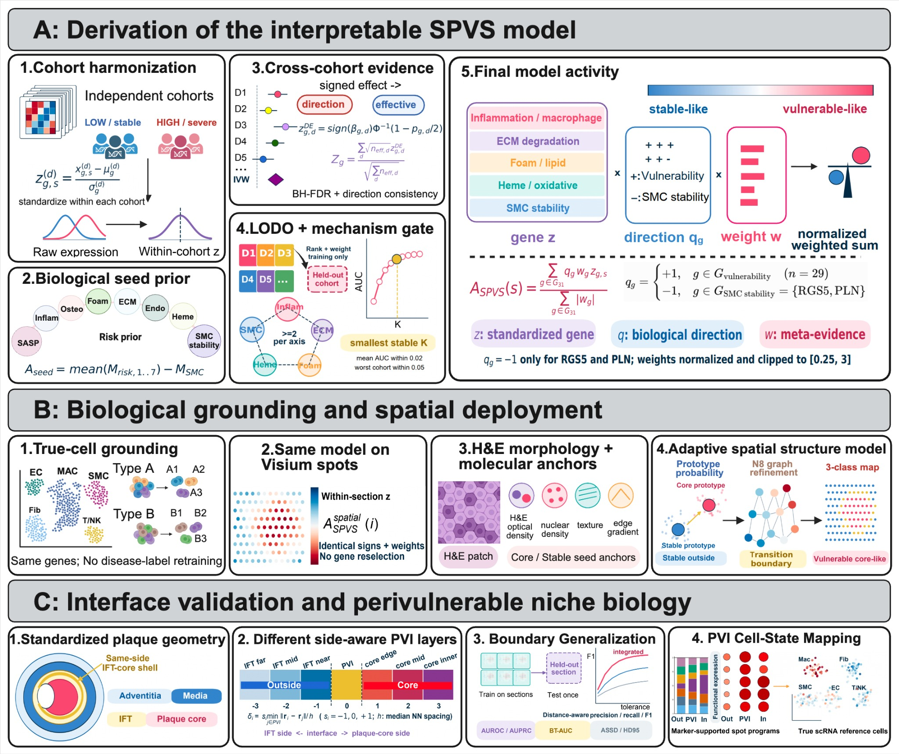

# SPVS: an interpretable spatial model of plaque vulnerability

This repository contains reviewer-facing source code for deriving, applying
and evaluating the Spatial Plaque Vulnerability State (SPVS) framework. The
analysis separates model-derived PVI prediction from the independently prepared
morphology-anchored anatomical reference used for post-prediction validation.



## Repository structure

```text
SPVS/
├── R/                         Core model, reference and validation functions
├── examples/                  Ordered reviewer-facing analysis scripts
├── config/                    Fixed study-server paths
├── reference/                 Reference-table schema and provenance notes
├── assets/                    Workflow overview
├── SPVS_FINAL.tar.gz          Installable SPVS source package
├── LICENSE
└── NOTICE
```

## Fixed analysis paths

The manuscript analysis used the following spatial transcriptomic object:

```text
/data/public/scRNA/Aging/aging_artery/Visium_Slides_Novo_Atherosclerosis.h5ad
```

Outputs were written under:

```text
/work/zzh/ZKN/AS模型/PB_SDM/results/
```

The paths are defined once in `config/paths.R` and `config/paths.py`. They are
intentionally study-specific because this repository is organized for reviewer
inspection of the manuscript analysis rather than as a portable demonstration.

## Reviewer-facing execution order

Run scripts from the repository root:

```r
source("examples/00_CheckStudyPaths.R")
source("examples/01_RunSPVS.R")
source("examples/02_PrepareAnatomicalReference.R")
source("examples/03_ValidateBoundary.R")
```

Install the bundled package before running the application example:

```r
install.packages("SPVS_FINAL.tar.gz", repos = NULL, type = "source")
```

For source-level inspection without installing the package:

```r
source("R/load_all.R")
```

## Prediction–reference separation

The two inputs to boundary validation are generated independently:

1. **Model prediction** — `Step10F_PB_SDM_layers_by_spot.csv`, containing the
   model-derived PVI classification.
2. **Anatomical reference** —
   `Step10G0D_same_shell_boundary_by_spot.csv`, prepared from the
   morphology-anchored anatomical compartment map.

The anatomical reference is not read by the SPVS prediction functions. It is
introduced only in `examples/03_ValidateBoundary.R`. Prediction and reference
are matched by exact section-plus-barcode identifiers. Validation is summarized
at the section level, with sections contributing equally to macro-average
performance estimates. Distance-aware evaluation reports tolerance-normalized
F1, average symmetric surface distance and the 95th-percentile Hausdorff
distance in spot-spacing units.

## Core code

- `R/ModelDerivation.R`: direction-aware cross-cohort evidence integration and
  frozen SPVS model derivation.
- `R/SpatialDataInput.R`: H5AD, matrix and Seurat-compatible spatial input.
- `R/PlaqueCoreModel.R`: interpretable plaque-core-like latent-state inference.
- `R/PlaqueVulnerabilityInterface.R`: model-derived PVI prediction.
- `R/AnatomicalReference.R`: independent anatomical-reference preparation.
- `R/BoundaryValidation.R`: exact and distance-aware PVI validation.
- `R/BoundaryEcology.R`: marker-supported PVI ecology summaries.
- `R/SingleCellGrounding.R`: projection of the frozen model to a single-cell
  reference without gene reselection.

## Research status

The SPVS package and associated manuscript are currently under peer review.
The code is released under the MIT License; see `LICENSE` and `NOTICE`.
